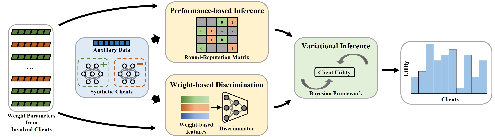

<h1 align="center"> FedTrans: Client-Transparent Utility Estimation for Robust Federated Learning</h1>


This repository is the official implementation of "[ShuffleFL: Addressing Heterogeneity in Multi-Device Federated Learning](https://openreview.net/pdf?id=DRu8PMHgCh)"
in the International Conference on Learning Representations (ICLR) 2024 


## Introduction
Federated Learning (FL) is an important privacy-preserving learning paradigm that plays an important role in the Intelligent Internet of Things. 
Training a global model in FL, however, is vulnerable to the data noise across the clients. In this paper, we introduce **FedTrans**, a novel 
client-transparent client utility estimation method designed to guide client selection for noisy scenarios, mitigating performance degradation 
problems. To estimate the client utility, we propose a Bayesian framework that models client utility and its relationships with the weight 
parameters and the performance of local models. We then introduce a variational inference algorithm to effectively infer client utility at the 
FL server, given only a small amount of auxiliary data. Our evaluation results demonstrate that leveraging FedTrans to select the clients can 
improve the accuracy performance (up to 7.8%), ensuring the robustness of FL in noisy scenarios.




## Dependencies
Please install the required packages first by executing the command:
```
pip install -r requirements.txt
```

## How to run

To train the model using FedTrans proposed in this paper, run the command:
```
python main.py
```

## Parameters
This repo includes the implementation of FedTrans under three different local data distributions (Dir/H2C/IID) on CIFAR10 and Fashion-MNIST datasets. 
In [conf.json](./conf.json), you can change the hyper-parameters and some settings. 

* Here we give the detailed 
description for each parameter defined in [conf.json](./utils/conf.json):

| Parameter                   | Description                                             |
|-----------------------------|---------------------------------------------------------|
| ` data`                     | dataset to use                                          |
| ` data_distribution`        | data distribution of clients                            |
| ` k`                        | number of clients involved in each round                |
| ` batch_size`               | batch size adopted in local training phase              |
| ` lr`                       | learning rate adopted in local training phase           |
| ` noisy_client_rate`        | the ratio of noisy clients to total clients             |
| ` noise_rate`               | noise rate                                              |
| ` noise_type`               | noise type                                              |
| ` auxiliary_data_len`       | size of auxiliary data                                  |
| ` num_pairs`                | pairs of synthetic positive/negative clients            |
| ` theta_threshold`          | threshold adopted in threshold-based selection strategy |
| ` global_epochs`            | number of global epochs                                 |
| ` local_epochs`             | number of local epochs                                  |
| ` m_epochs`                 | training epochs of discriminator                        |
| ` m_lr`                     | learning rate of discriminator                          |
| ` n_neurons_1, n_neurons_2` | number of neurons of hidden layers of discriminator     |
| ` e_iterr`                  | number of iterations of performance-based inference     |
| ` em_iterr`                 | number of iterations of variational EM                  |
| ` em_iterr`                 | number of iterations of variational EM                  |


## Citation

If our work is userful for your research, please consider citing:

```
@inproceedings{
yang2024fedtrans,
title={FedTrans: Client-Transparent Utility Estimation for Robust Federated Learning},
author={Mingkun Yang and Ran Zhu and Qing Wang and Jie Yang},
booktitle={The Twelfth International Conference on Learning Representations},
year={2024},
url={https://openreview.net/forum?id=DRu8PMHgCh}
}

```

## Contact
Feel free to contact authors or leave an issue if face with a problem when using this implementation.
